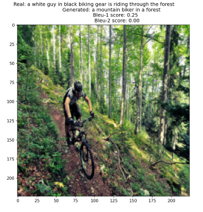
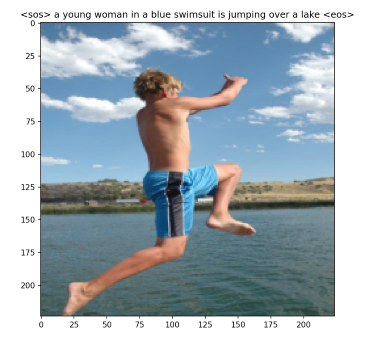

# ImageCaption

Image captioning model in pytorch using Resnet50 as encoder and LSTM as decoder.

## How to run this code

You'll need [Git](https://git-scm.com) to be installed on your computer.

```bash
git clone https://github.com/nssharmaofficial/ImageCaption_Flickr30k
```

To install the requirements use:

```bash
pip3 install -r requirements.txt
```

- You can download the images and captions [here](https://www.kaggle.com/datasets/adityajn105/flickr30k).
- Captions were split 70/30 into `train_list.txt` and `val_list.txt`.

## Vocabulary

To build a vocabulary with *word2index* and *index2word* dictionaries, run:

```bash
vocab.py captions.txt vocabulary.txt 5000
```

where the first argument defines the text file from which the vocabulary will be built, the second defines the text file in which the *word2index* dictionary will be saved and the last defines the vocabulary size (including the 4 predefined tokens: `<pad>`, `<sos>`, `<eos>` and `<unk>`)

## Dataset

Custom class `ImageCaptionDataset()` holds a list of samples where each sample is a dictionary containing the image file ID and the caption of that image as a list of word indices. The caption is enriched by `<sos>` and `<eos>` token at the beggining and end of caption respectively.

The `__getitem__` returns an image (preprocessed, as tensor) and the caption as a list of word indices.

The function:

```python
get_data_loader(train_data, batch_size = config.BATCH, pad_index = vocab.PADDING_INDEX)
```

returns a data loader where each caption in a batch is padded with `vocab.PADDING_INDEX` which is in this case `0` to reach the length of longest caption in the batch (using `pad_sequence`)

You can check the data loader by running `dataset.py`.

## Model

The whole model consists of 3 parts:

- encoder
- embeddings
- decoder

Running `model.py` will perform one forward operation of the whole model (with randomly initialized inputs). The results might help you to understand the dimensions of the outputs better.

### Encoder

Image encoder is used to obtain features from images. The encoder consists of pretrained Resnet50 model with the last layer removed, and a linear layer with the output dimension of `(IMAGE_EMB_DIM)`.

### Embeddings

Embedding layer is used to obtain embedded representation (as a dense vector) of captions of dimension `(WORD_EMB_DIM)`.  When training the model, the embedding layer is updated to learn better word representations through the optimization process.

### Decoder

Decoder taking as input for the LSTM layer the concatenation of features obtained from the encoder and embedded captions obtained from the embedding layer. Hidden and cell states are zero initialized. Final classifier is a linear layer with output dimension of `(VOCAB_SIZE)`.

## Configurations

For running other files it is necessary to check the `config.py` and change it accordingly to your wish and situation:

```python
self.DEVICE = torch.device("cuda:0")

self.BATCH = 32
self.EPOCHS = 5

self.VOCAB_FILE = 'word2index5000.txt'
self.VOCAB_SIZE = 5000

self.NUM_LAYER = 1
self.IMAGE_EMB_DIM = 512
self.WORD_EMB_DIM = 512
self.HIDDEN_DIM = 1024
self.LR = 0.001

self.EMBEDDING_WEIGHT_FILE = 'checkpoints/embeddings-32B-1024H-1L-e5.pt'
self.ENCODER_WEIGHT_FILE = 'checkpoints/encoder-32B-1024H-1L-e5.pt'
self.DECODER_WEIGHT_FILE = 'checkpoints/decoder-32B-1024H-1L-e5.pt'

self.ROOT = os.path.join(os.path.expanduser('~'), 'Github', 'ImageCaption_Flickr30k')
```

If not done already, create specific folder `checkpoints` in `code` folder to store weights of trained model.

## Training and evaluating data

To train the model run `train.py`.

**Note**: during the training and evaluation, the model is used to generate captions ***word-by-word*** over the `SEQ_LENGTH-1` loop (ignoring the last `<eos>` token), therefore the dimension of the embedded captions before the concatenation will be `(length = j+1, BATCH, WORD_EMB_DIM)`, and the dimension of features will be `(j+1, BATCH,  IMAGE_EMB_DIM)`. The hidden and cell states are initialized to a tensor of size `(NUM_LAYER, BATCH, HIDDEN_DIM)` where `HIDDEN_DIM = IMAGE_EMB_DIM + WORD_EMB_DIM`.

So for example the caption: `<sos>` dog is running outside `<eos>` will be trained over loop:

- starting with `<sos>` token: `<sos>` <word_to_be_predicted> → then <word_to_be_predicted> is compared to the original next word
- `<sos>` dog <word_to_be_predicted>
- `<sos>` dog is <word_to_be_predicted>
- `<sos>` dog is running <word_to_be_predicted>
- `<sos>` dog is running outside <word_to_be_predicted> → so that we learn to predict the `<eos>` as well

**Note**: The `train_whole_sequence.py` uses different approach of training, using the whole captions:

- LSTM layer takes input and computes the output of length = `SEQ_LENGTH` (instead of length = `j+1` as in `train.py`)
- to make this work, the `features` have dimension `(SEQ_LENGTH, BATCH, IMAGE_EMB_DIM)` (instead of `(j+1, BATCH, IMAGE_EMB_DIM)`) in order to be concatenated with the `emb_captions_batch` of size `(SEQ_LENGTH, BATCH, WORD_EMB_DIM)`

After training the model you can visualize the results on validation data by running `test_show.py`. It will show the image along with the title containing real captions, generated captions and the BLEU score (1 and 2).

Captions are generated **word-by-word** starting with the SOS token. Next predicted word IDs are then being appended for the next LSTM input.

Model with **B = 32** and **HIDDEN_DIM = 512**:

 

## Generating captions on sample image

Run `predict_sample.py  sample_image.jpg` to generate captions on an image (in ROOT path).

Model with **B = 32** and **HIDDEN_DIM = 512**:

 
