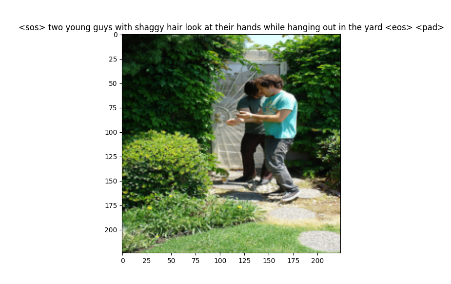
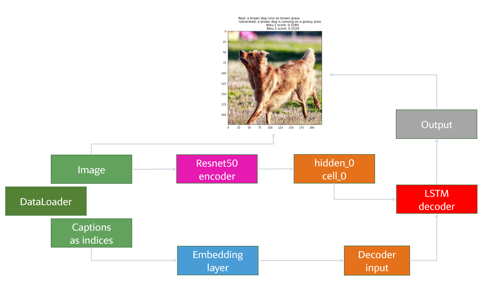
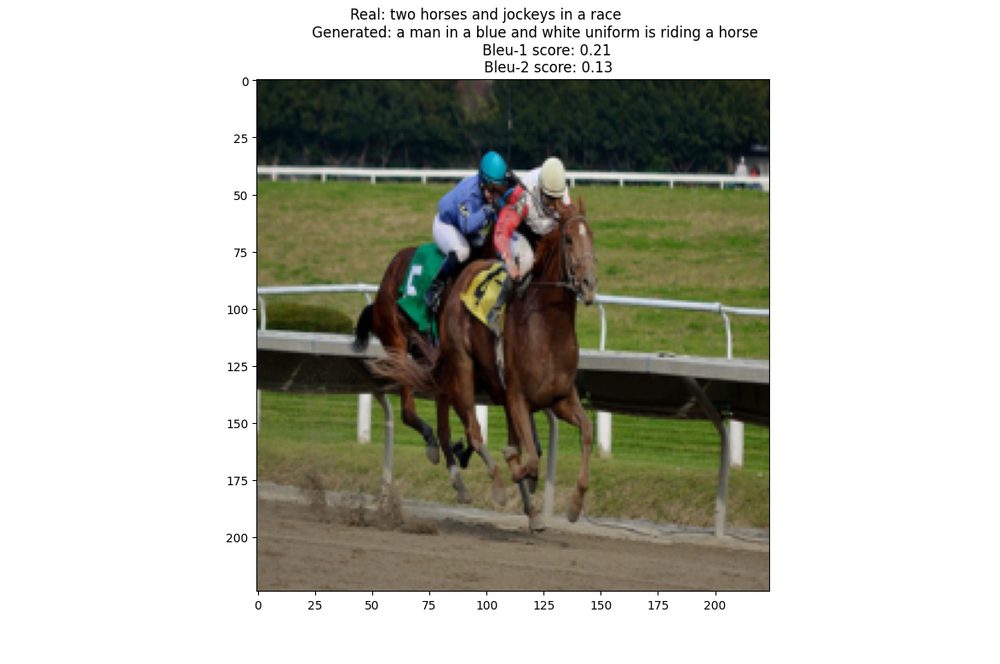
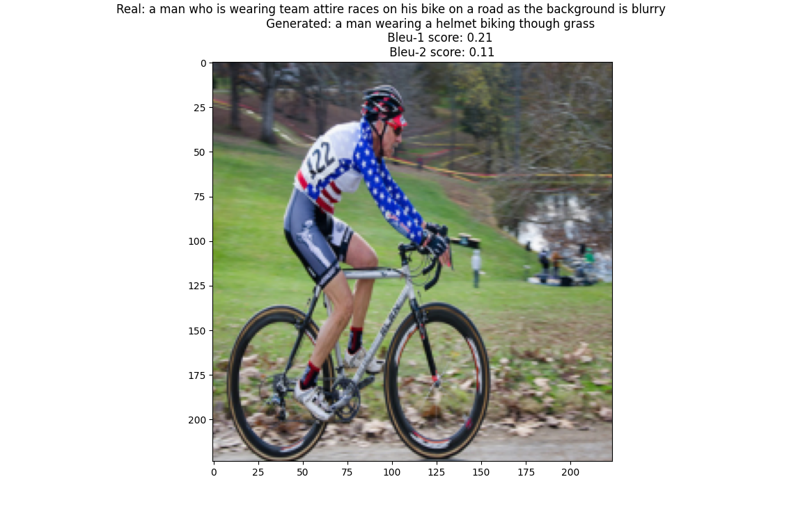
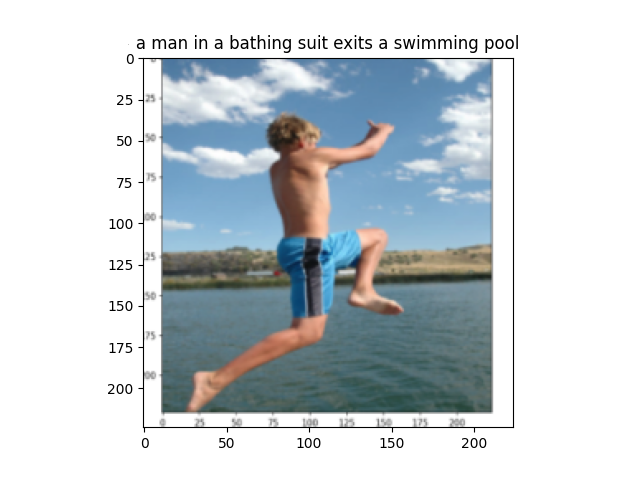
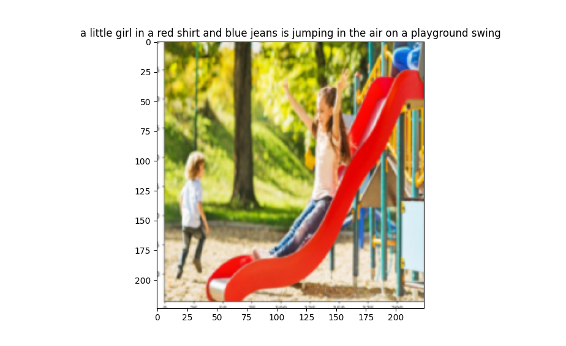

# 📸 Image caption generator

A PyTorch-based image captioning model using ResNet50 as the encoder and LSTM as the decoder. This model generates captions for images by learning from the Flickr30k dataset.

You can run the inference of the trained model on [🤗 Hugging Face - ImageCaption](https://huggingface.co/spaces/nssharmaofficial/ImageCaption).

## 🛠️ Setup and Installation

To get started, you'll need [Git](https://git-scm.com) installed on your system. Clone this repository:

```bash
git clone https://github.com/nssharmaofficial/ImageCaption_Flickr30k
```

Install the required dependencies by running:

```bash
pip install -r requirements.txt
```

### Dataset Preparation

- Download the **Flickr30k** images and captions from [this Kaggle dataset](https://www.kaggle.com/datasets/adityajn105/flickr30k).
- Split captions into `train_list.txt` (90%) and `val_list.txt` (10%).

## 🧠 Vocabulary

To create the vocabulary with *word2index* and *index2word* mappings, run:

```bash
python code/vocab.py captions.txt vocabulary.txt 5000
```

- The first argument: Input file containing captions.
- The second argument: Output file for the vocabulary.
- The third argument: Maximum vocabulary size (includes 4 special tokens: `<pad>`, `<sos>`, `<eos>`, and `<unk>`).

## 📚 Dataset Class

The custom class `ImageCaptionDataset()` holds samples, where each sample contains:

- **Image File ID**
- **Caption**: As a list of word indices, enriched with `<sos>` and `<eos>` tokens at the beginning and end, respectively.

The `__getitem__()` method returns:

- Preprocessed image (as a tensor)
- Caption as a list of word indices

To load data efficiently, use:

```python
get_data_loader(train_data, batch_size=config.BATCH, pad_index=vocab.PADDING_INDEX)
```

Captions are padded to the length of the longest caption in the batch using `vocab.PADDING_INDEX` (0).

Run [dataset.py](./code/dataset.py) to check the data loader as well as to sort the training and validation captions.



## 🧩 Model Overview



The model consists of three main components:

1. **Encoder**
2. **Embeddings**
3. **Decoder**

You can test the model by running [`model.py`](./code/model.py), which performs a forward pass with random inputs, helping you understand the output dimensions.

### 🖼️ Encoder

The encoder extracts features from images using a pretrained **ResNet50** model (with the last layer removed) and a linear layer. The final output dimension is `(IMAGE_EMB_DIM)`.

### 📝 Embeddings

An embedding layer transforms captions into dense vector representations of dimension `(WORD_EMB_DIM)`. During training, the embedding layer learns better word representations.

### 🗣️ Decoder

The decoder uses an LSTM to generate captions. It takes the word embeddings as input and outputs probabilities for the next word in the sequence.

**Implementation Details:**

- LSTM: Processes the sequence of word embeddings.
- Fully connected layer: Outputs word probabilities for each word in the vocabulary.
- LogSoftmax: Applied to convert raw scores to probabilities.

## ⚙️ Configuration

Customize settings in `config.py` as needed.

> **Note**: Ensure you have created the `checkpoints` and `saved` directories in the `code` folder to store the model's weights.

## 🏋️‍♂️ Training and Evaluation

To train the model, run [`train.py`](./code/train.py)

During training, captions are generated word by word in a loop of length `SEQ_LENGTH-1`. The hidden and cell states are initialized as tensors of size `(NUM_LAYER, BATCH, HIDDEN_DIM)`, where `HIDDEN_DIM` is set to `IMAGE_EMB_DIM`.

You can visualize results on validation data by running [`test_show.py`](./code/test_show.py)

This script will display images along with real captions, generated captions, and BLEU scores (BLEU-1 and BLEU-2) to evaluate caption quality.

### 📊 Caption Generation

Captions are generated word by word starting with the `<sos>` token. Each predicted word is used as input for the next step. The process continues until the `<eos>` token is generated or the maximum length is reached.

Below are examples with a trained model:




## 📷 Generating Captions on Sample Images

To generate captions for a new image, run:

```bash
python code/predict_sample.py sample_image.jpg
```

This will output captions generated by the model. Below are some examples:



